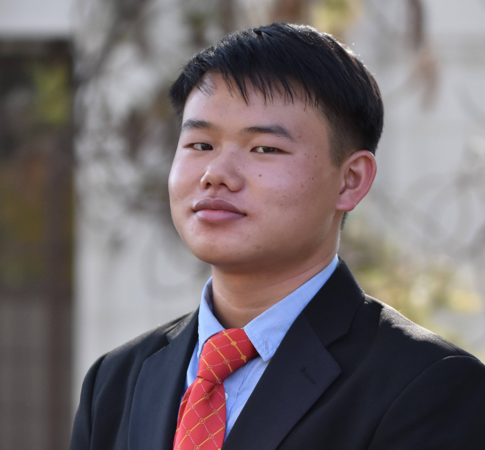

### Hi there! 👋

## I'm Enoch Tseng, an EECS major + DS minor undergraduate at UC Berkeley :)

  
  

---

- 🔎 I'm actively seeking an internship for Summer 2024!
- 📚 I’m currently studying **Database Systems** (CS 186), **Artificial Intelligence** (CS 188), **Extended Reality (VR/AR) Development** (CS 198-80), and **Web App Development** (CS 198-750)
- 🧐 Interested in my past projects? Previous coursework? Prior experiences? Let me know!
  - 🚀 Relevant projects/contributions include a **Scheme interpreter**, an **Engima cipher**, a **mini-Git simulator**, **mobile + web development**, **web scrapers**, **AI for miscellaneous games**, and more!
  - 🏰 Most of my work are in private repositories, so please reach out if you want to take a look!
  - 📫 Contact me via [LinkedIn](https://www.linkedin.com/in/enoch-tseng/), [Handshake](https://app.joinhandshake.com/stu/users/33148613), [my website](https://enoch-tseng.github.io/), or shoot me an email at estseng@berkeley.edu

<!--
**enoch-tseng/enoch-tseng** is a ✨ _special_ ✨ repository because its `README.md` (this file) appears on your GitHub profile.

Here are some ideas to get you started:

- 🔭 I’m currently working on ...
- 🌱 I’m currently learning ...
- 👯 I’m looking to collaborate on ...
- 🤔 I’m looking for help with ...
- 💬 Ask me about ...
- 📫 How to reach me: ...
- 😄 Pronouns: ...
- ⚡ Fun fact: ...
-->
